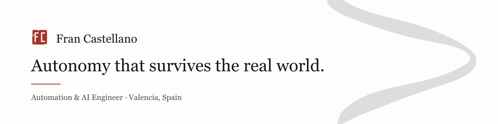

<picture>
  <source media="(prefers-color-scheme: dark)" srcset="banner-dark.png">
  
</picture>

## I came to AI through the factory floor

Most people building autonomous systems arrive from machine learning and meet
the real world later, usually as a disappointment. I arrived the other way
round: a year inside industrial plants writing requirements for systems where a
failure is not a worse number on a benchmark — it is a stopped line, with people
standing next to it.

That is the whole reason I work on making autonomy safe, and the shape of
everything below is the same. Learn it, bound it, then measure it somewhere
real.

**Right now** — master's thesis at **GMV Aerospace and Defence**, on safe
reinforcement learning for planning and control.

---

### Selected work

**[Safe RL with Internal Model Feedback](https://francastellano.netlify.app/projects/safe-rl-internal-model/)** · *ongoing*
Inverse reinforcement learning recovers the objective as an attractor-based
vector field, and the controller balances two things at once: performance on the
task, and how much control authority it still has in hand. A policy that spends
all of its authority going fast has none left when a rock appears.

**[Data-Driven Uncertainty](https://francastellano.netlify.app/projects/data-driven-uncertainty/)** · *ongoing*
Every stage of an autonomy stack adds error — sensors, the map built from them,
the map against the real world, the planner, the controller, and the measurement
the system was sent to make. Six sources, one accumulated outcome, and a method
for finding which one is actually costing you.

**[Transfer Learning for Locomotion](https://francastellano.netlify.app/projects/transfer-locomotion/)** · *B.Sc. thesis*
A spider and a dog each learn to walk; both are compressed into a shared latent
and transferred into a humanoid, which is finished with imitation learning. The
humanoid is the worst possible body to learn on, so it never starts from
nothing.

**[Crown-of-Thorns Starfish on Coral Reefs](https://francastellano.netlify.app/projects/reef-starfish-detection/)** · *2023*
YOLOv7 and a Kalman filter on the CSIRO Great Barrier Reef dataset. A count is
not a sum of detections — the same starfish arrives in the next frame, and the
filter is what stops one animal from being reported as twenty.

**[Centralised SCADA Architecture](https://francastellano.netlify.app/projects/scada-integration/)** · *2024–25*
Two industrial processes brought under supervisory control in Ignition and made
to coordinate through their SCADA layer instead of through an operator, over
whatever protocol the hardware could actually speak.

---

### Tools

`Python` `PyTorch` `MuJoCo` `Gymnasium` `ROS 2` `Gazebo` `OpenCV`
`Ignition SCADA` `OPC UA` `Modbus` `MQTT` `Docker` `Git`

### Where the code is

Most of this lives in private repositories, university archives or under client
confidentiality, so this profile is quieter than the work is. The write-ups, the
reasoning and the notebook behind them are on the site — including 42 notes
transcribed from the pages I fill while reading.

### Elsewhere

- **[francastellano.netlify.app](https://francastellano.netlify.app)** — projects and notes
- **[LinkedIn](https://www.linkedin.com/in/francasterw)**
- **francasterw@gmail.com**

Open to roles in autonomy, control and applied AI — especially where the system has to run somewhere real.
